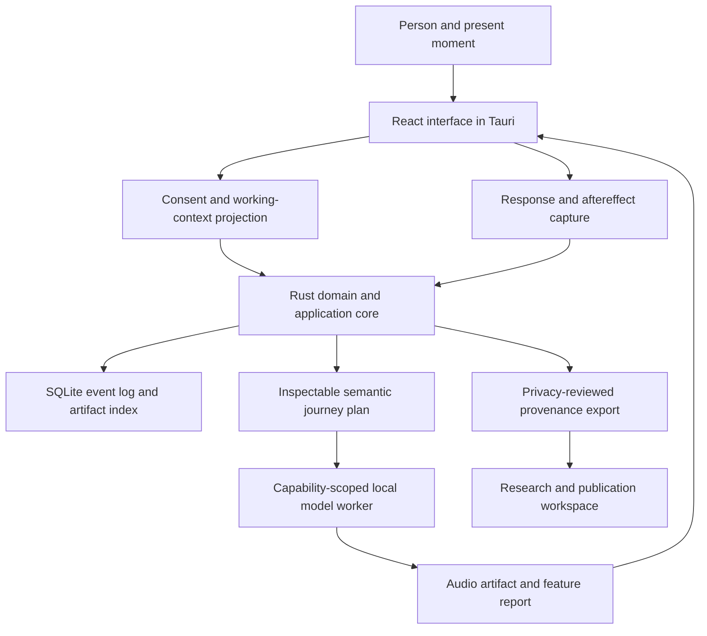
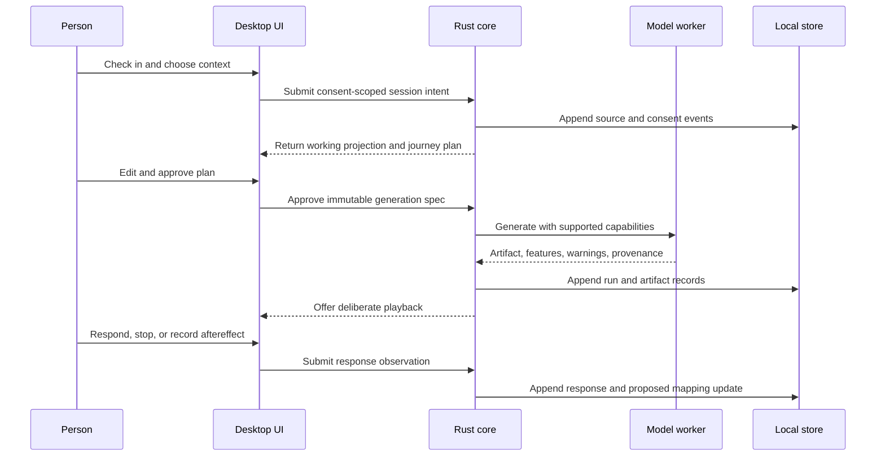

# Antidote Architecture

## Purpose and scope

Antidote uses a layered, contract-driven architecture for two related products
owned by one research program:

1. a reproducible research and publication workspace that already exists; and
2. a transparent local prototype that will generate, present, and evaluate
   moment-specific personalized audio journeys.

This document owns structural boundaries, dependency direction, trust zones,
integration rules, and current-to-target evolution. [SYSTEM.md](SYSTEM.md) owns
logical responsibilities, [ONTOLOGY.md](ONTOLOGY.md) owns domain identity, and
[DECISIONS.md](DECISIONS.md) indexes durable choices.

## Current and target state

| Surface | State | Evidence boundary |
| --- | --- | --- |
| Research source and claim discipline | Implemented | `paper/`, `research/`, `data/`, and repository checks |
| Native publication build and Holon-composed hub | Implemented; deployment remains gated | Exact-pinned site suite, Make/Task scripts, CI workflows, deterministic Pages staging |
| Architecture corpus | Provisional | Eighteen repository-local documents indexed by `META.md` |
| MVP interoperability contracts | Executable foundation | Canonical schemas, generated projections, and shared fixtures under `contracts/` |
| Desktop application | Executable synthetic session | Accessible Tauri/React flow invokes named Rust commands and recovers canonical state under `apps/desktop/` |
| Rust domain and control plane | Authoritative session core and Level-1 planner implemented | Pure commands, immutable events, replay, consent gates, traceable plan rules, immutable revisions, safety halts, and ports under `crates/antidote-core/` |
| Local persistence | Adapter implemented; integration remains target | Versioned SQLite migrations, immutable event repository, rebuildable lineage views, and atomic content-addressed objects under `crates/antidote-store/` |
| Local generation worker | Deterministic mock + Rust supervision implemented | Bounded NDJSON process, protocol/capability validation, synthetic WAV/analysis, cancellation, timeout, restart, artifact-integrity, and failure tests; no AI model exists |
| Formal study | Not started | Requires frozen protocol, consent/privacy decisions, and stop rules |

“Target” and “scaffolded” are not claims of executable functionality.

## Layer model

1. **Intent and contracts** — architecture, accepted decisions, protocols,
   consent rules, schemas, model cards, and version compatibility.
2. **Domain** — moment, state, transition, semantic meaning, journey, generation,
   exposure, response, safety, personal mapping, and provenance behavior.
3. **Application** — session planning, context projection, generation
   orchestration, response capture, adaptation proposals, and export use cases.
4. **Adapters** — SQLite, filesystem, Tauri, audio playback, model workers,
   analyzers, optional sensors, and future Ego Hygiene integrations.
5. **Interfaces** — React desktop experience, developer commands, protocol
   tools, research exports, paper, magazine, and publication hub.
6. **Evidence** — tests, diagnostics, immutable events, hashes, feature reports,
   participant reports, claim ledger, provenance, and CI artifacts.

Dependencies point inward toward contracts and domain behavior. Framework,
storage, provider, and model conventions do not become canonical domain truth.

## Structural view



## Runtime sequence



## Process and authority boundaries

| Boundary | Owns | Must not own |
| --- | --- | --- |
| React interface | Interaction state, accessible presentation, local form validation, waveform visualization | Canonical session state, consent authority, model secrets, scientific conclusions |
| Tauri host | Desktop lifecycle, command permissions, sidecar launch, operating-system capabilities | Domain rules tied to one window or webview |
| Rust core | Consent policy, state machine, journey validation, orchestration, event semantics, provenance, adaptation authority | Model-native preprocessing or UI-only representation |
| SQLite/filesystem adapters | Transactional events, indexes, classified payloads, content-addressed artifacts | Meaning not supplied by domain contracts |
| Python model worker | Model capability reporting, pinned loading, generation, analysis, cancellation, runtime warnings | Database access, unrestricted personal history, adaptation decisions, publication authority |
| Audio adapter | Preview, playback, stop, export, and optional transparent processing | Claims about felt response or therapeutic effect |
| Research workspace | Protocol, evidence review, claim ledger, manuscript, public-safe export, publication | Private runtime state not explicitly approved for research use |

## Context and memory boundary

Antidote distinguishes a consented source record, replaceable derived
projections, and the current authorized working view. Raw records remain outside
the model boundary. The worker receives only the approved semantic projection,
accepted journey plan, and generation specification.

Retrieval combines deterministic filters and lexical search before any optional
semantic ranking. Every retrieved element retains source, purpose, derivation,
and expiry metadata. A summary can be regenerated without overwriting its
sources.

## Model-worker protocol

The initial sidecar contract exposes a small versioned operation set:

| Operation | Responsibility |
| --- | --- |
| `hello` | Negotiate protocol version and worker identity |
| `capabilities` | Report adapters, licenses, controls, hardware, durations, and known restrictions |
| `load_model` | Load a pinned model ID and revision after integrity checks |
| `generate` | Accept an immutable generation spec, stream progress, and return artifacts plus warnings |
| `analyze` | Measure declared acoustic features and control adherence |
| `cancel` | Cooperatively stop work and classify partial outputs |
| `health` | Report readiness and resource state without personal content |

Every result records model ID, model and code revision, adapter version, seed
when supported, generation parameters, elapsed time, device class, input-plan
hash, output hashes, downgrades, warnings, and failure classification.

ACE-Step 1.5 is the leading candidate for the first adapter; MusicGen remains a
comparison baseline. Neither becomes a dependency until license, remote-code,
hardware, control-adherence, and output-rights review is recorded.

The executable mock worker implements the complete v1 operation set with a
65,536-byte NDJSON limit, strict envelopes, a built-in immutable model identity,
atomic synthetic WAV realization, declared WAV analysis, cooperative
cancellation, and explicit simulated timeout, partial-output, and crash
classes. It has no database, network, model package, or weight dependency. Its
golden artifact hash proves deterministic bytes for the canonical fixture.
The `antidote-worker` Rust adapter now launches it without shell interpolation,
clears and rebuilds its explicit environment, negotiates identity and
capabilities, correlates progress and cancellation, enforces deadlines, drains
stderr without retaining content, and verifies every returned artifact against
a host-created directory, byte limit, and SHA-256 digest. The core
`GenerationOrchestrator` appends start and terminal facts through commands; a
process or protocol failure becomes a failed result and cannot become generated.
The desktop host now composes this supervisor through named Tauri commands,
persists the canonical session under the application-local data directory, and
returns bounded projections to React. Repository-relative developer worker
discovery is temporary; packaged sidecar paths, operating-system sandboxing,
and a real model adapter remain separate work.

## Level-1 journey planning

`RuleGuidedPlanner` is a pure Rust application/domain service. For the same
moment contract, plan identifier, rule-set version, and control policy it emits
the same draft bytes and SHA-256 content hash. The proposal records:

- the rule-set ID/version and exact input hash;
- the supported controls and conservative prototype ceilings used;
- a rationale and uncertainty statement for every derived strategy, duration,
  stage, semantic instruction, and populated acoustic control; and
- revision and supersession lineage.

Person edits replace typed semantic or acoustic choices and produce a new
sealed revision. Rejection, supersession, and approval are separate immutable
session events; approval never rewrites plan content. The core rejects duration
mismatch, contradictory inclusions/exclusions, excluded instructions,
unsupported controls, stagewise combinations the policy cannot express,
control-ceiling violations, missing derivations, prohibited efficacy or
deterministic-mechanism rationale, and hash mutation.

These rules are transparent prototype defaults. They do not predict what will
feel useful, infer consent, learn from history, or make a clinical claim.

## Local persistence

| Record | Function |
| --- | --- |
| `events` | Immutable ordered facts about person and system actions |
| `payloads` | Classified references to sensitive or large local content |
| `consent_grants` | Source-, purpose-, action-, and session-scoped authority |
| `projections` | Versioned derived context with source-event lineage |
| `journey_plans` | Human-readable trajectories, stages, constraints, and controls |
| `generation_runs` | Immutable invocation specs and runtime results |
| `artifacts` | Audio, format, waveform, analysis, hash, and provenance metadata |
| `exposures` | What was actually played, when, for how long, and whether it stopped |
| `responses` | Felt response, helpfulness, intensity, mismatch, harm, and later aftereffect |
| `model_snapshots` | Versioned personal mapping estimates and change evidence |

SQLite is sufficient for the first local implementation. Large audio and
sensitive payloads remain content-addressed files rather than database blobs.
Encryption, key recovery, backup, secure deletion, and projection invalidation
are required design work before non-developer personal use.

The implemented adapter verifies each serialized event against its content
digest and the domain replay rules, uses optimistic expected-version appends,
and treats an exact retry as idempotent. Named projection tables are disposable
event-classified views with source-event lineage, not a second authority. Object
writes use synchronized temporary files followed by an atomic no-clobber link. The
desktop host has not yet selected or opened production database/object paths.

## Repository boundaries

```text
apps/
  desktop/                 Tauri host and React interface
crates/
  antidote-contracts/      generated types and canonical-schema validation
  antidote-core/           pure domain and application behavior
  antidote-store/          event, projection, and payload adapters
  antidote-provenance/     hashes, manifests, model cards, and research export
  antidote-audio/          playback and export ports/adapters
workers/
  generation/              Python model-worker protocol and adapters
contracts/
  schemas/                 versioned cross-language JSON Schemas
  fixtures/                shared synthetic positive and negative cases
experiments/
  protocols/               N-of-1 definitions, assignments, measures, and analysis
paper/, research/, data/   canonical scientific source and approved evidence
scripts/, latex/, web/     project-owned publication and composition implementation
publication/, site/        exact Holon pins, reviewed site content, and bounded adapter
docs/                      architecture guides, ADRs, and Antidote-owned route source
```

The directory READMEs and schemas establish ownership; they do not fabricate an
application. Language workspaces and framework manifests land with the first
tested vertical slice.

## Dependency rules

- Sibling capabilities integrate through versioned public contracts, releases,
  or immutable revisions—not source copies or mutable default branches.
- Contracts live with their capability owner. Rust, TypeScript, and Python may
  generate local types but do not fork schema meaning.
- The domain core does not depend on Tauri, React, SQLite, Python, a model
  provider, or a publication framework.
- Generated artifacts never become canonical source unless an accepted decision
  explicitly changes ownership.
- Read, project, approve, generate, expose, learn, export, and publish remain
  separate authority boundaries.
- Cross-process inputs are validated, size-bounded, versioned, and treated as
  untrusted even on localhost.
- Secrets, private participant records, unreviewed model weights, and personal
  exports never enter images, templates, public fixtures, or the repository.

## Ego Hygiene integration

Antidote is both a standalone research program and a candidate future product
capability. Ego Hygiene may eventually provide journal or therapy-chat context,
identity preferences, and shared design tokens. It must do so through explicit
versioned projections and present consent.

Antidote does not depend on the Ego Hygiene application to function. The future
application may host or call Antidote ports, but it does not absorb the
scientific ontology, model-worker protocol, provenance record, or research
source. Antidote similarly does not reach into sibling repository internals.

## Publication architecture

Antidote owns manuscript text, bibliography, figures, research notes, source
assessments, local renderer, checks, themes, site staging, and Make/Task
interfaces. Beacon owns the upstream reusable research-paper profile and
optional control-plane behavior. Relay owns reusable workflow implementation;
Egolint owns lint semantics.

The custom-domain publication hub is a disposable projection over committed
source. Holon owns its reusable LaunchKit, Zensical, and composition profiles;
Antidote consumes one exact commit and owns reviewed content, identity inputs,
paper bytes, routes, manifests, checksums, and deployment. The build validates
profile Git blobs and SHA-256 inventories in a clean room, then overlays the
governed paper artifacts. `publication.json` describes the paper and generated
`site.json` catalogs available or planned formats. No workflow submits a
manuscript, creates a scientific claim, or activates a planned artifact
automatically.

## Deployment and portability

The MVP is a local desktop research instrument. Optional cloud synchronization,
remote inference, collaborative studies, or managed services remain outside the
first deployment boundary. Any later service must preserve export, local
ownership, explicit cost, authentication, privacy, availability, and a
replaceable adapter.

The publication hub remains independently deployable through its existing
gated GitHub Pages workflow. Runtime and publication deployments are separate
surfaces even though their evidence may later connect.

## Evidence and uncertainty

- **Observed:** The publication architecture, framework-independent session
  core, Level-1 journey planner, generation orchestrator, SQLite event adapter,
  named lineage projections, content-addressed object store, deterministic mock
  worker, and bounded Rust process supervisor are implemented. Desktop
  composition remains planned.
- **Decided for the MVP:** Tauri + React hosts a Rust authority boundary and a
  capability-scoped Python/PyTorch worker; context is explicit and local-first.
- **Proposed:** W3C PROV concepts and RO-Crate shape shareable experiment
  exports; optional LSL adapters may support later synchronized sensors.
- **Open questions:** Storage encryption, exact model adapter, supported
  hardware, process sandboxing, and the external-review threshold for personal
  use remain unresolved.
