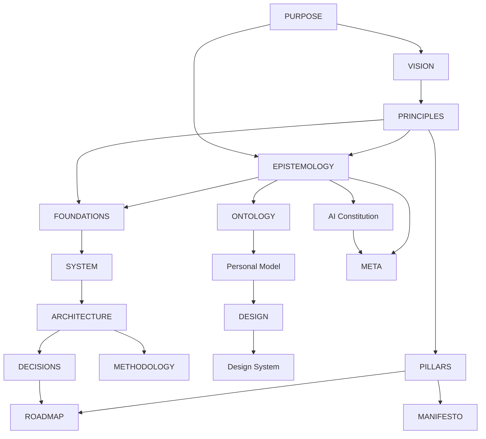

# Antidote Meta Architecture

## Architecture-system overview

Antidote's architecture is an 18-document graph shaped by the Aether
architecture-document contract and specialized for the Antidote bounded
context. Each document owns one concern; this index maps the graph without
replacing those documents.

## Document inventory

| Artifact | Path | Category | Status | Governing specification | Upstream dependencies |
| --- | --- | --- | --- | --- | --- |
| antidote-purpose | [PURPOSE.md](PURPOSE.md) | Identity | provisional | architecture-purpose | — |
| antidote-vision | [VISION.md](VISION.md) | Identity | provisional | architecture-vision | antidote-purpose |
| antidote-principles | [PRINCIPLES.md](PRINCIPLES.md) | Identity | provisional | architecture-principles | antidote-purpose, antidote-vision |
| antidote-pillars | [PILLARS.md](PILLARS.md) | Identity | provisional | architecture-pillars | antidote-purpose, antidote-vision, antidote-principles |
| antidote-manifesto | [MANIFESTO.md](MANIFESTO.md) | Identity | provisional | architecture-manifesto | antidote-purpose, antidote-vision, antidote-principles, antidote-pillars |
| antidote-epistemology | [EPISTEMOLOGY.md](EPISTEMOLOGY.md) | Meta | provisional | architecture-epistemology | antidote-purpose, antidote-principles |
| antidote-ai-constitution | [AI_CONSTITUTION.md](AI_CONSTITUTION.md) | Meta | provisional | architecture-ai-constitution | antidote-purpose, antidote-vision, antidote-principles, antidote-epistemology |
| antidote-ontology | [ONTOLOGY.md](ONTOLOGY.md) | Domain | provisional | architecture-ontology | antidote-purpose, antidote-vision, antidote-principles, antidote-epistemology |
| antidote-personal-model | [PERSONAL_MODEL.md](PERSONAL_MODEL.md) | Domain | provisional | architecture-personal-model | antidote-purpose, antidote-vision, antidote-principles, antidote-epistemology, antidote-ontology |
| antidote-foundations | [FOUNDATIONS.md](FOUNDATIONS.md) | Foundation | provisional | architecture-foundations | antidote-purpose, antidote-principles, antidote-epistemology |
| antidote-system | [SYSTEM.md](SYSTEM.md) | Foundation | provisional | architecture-system | antidote-foundations, antidote-ontology |
| antidote-architecture | [ARCHITECTURE.md](ARCHITECTURE.md) | Foundation | provisional | architecture-architecture | antidote-foundations, antidote-system |
| antidote-methodology | [METHODOLOGY.md](METHODOLOGY.md) | Foundation | provisional | architecture-methodology | antidote-principles, antidote-epistemology, antidote-ai-constitution, antidote-foundations, antidote-architecture |
| antidote-design | [DESIGN.md](DESIGN.md) | Experience | provisional | architecture-design | antidote-purpose, antidote-vision, antidote-principles, antidote-personal-model |
| antidote-design-system | [DESIGN_SYSTEM.md](DESIGN_SYSTEM.md) | Experience | provisional | architecture-design-system | antidote-personal-model, antidote-design |
| antidote-decisions | [DECISIONS.md](DECISIONS.md) | Governance | provisional | architecture-decisions | antidote-principles, antidote-epistemology, antidote-foundations, antidote-system, antidote-architecture |
| antidote-roadmap | [ROADMAP.md](ROADMAP.md) | Foundation | provisional | architecture-roadmap | antidote-vision, antidote-pillars, antidote-architecture, antidote-decisions |
| antidote-meta | [META.md](META.md) | Meta | provisional | architecture-meta | antidote-epistemology, antidote-ai-constitution |

## Relationship graph

## Ownership map

- Identity documents own why Antidote exists, its desired future, decision
  heuristics, enduring capabilities, and public commitments.
- Meta documents own knowledge integrity, AI authority, and navigation.
- Domain documents own personal, moment, journey, audio, response, and evidence
  concepts without dictating code or storage layouts.
- Foundation documents own invariants, logical systems, structure, working
  method, and evolution.
- Experience documents own the human journey and semantic design language.
- Governance owns durable decisions and historical lineage.

## Reading order

1. PURPOSE, VISION, and PRINCIPLES.
2. EPISTEMOLOGY and ONTOLOGY.
3. FOUNDATIONS, SYSTEM, and ARCHITECTURE.
4. PERSONAL_MODEL, DESIGN, and DESIGN_SYSTEM for human-facing work.
5. AI_CONSTITUTION before delegating personal-context or adaptation work.
6. DECISIONS and ROADMAP for accepted constraints and sequencing.

## Lifecycle and validation

All documents remain provisional until human review. Validation covers
frontmatter, stable IDs, link resolution, dependency acyclicity, bounded
ownership, evidence labels, Markdown structure, and agreement with repository
reality. A material upstream change triggers review of downstream nodes.

## Reuse provenance

The document graph and common governance structure were adapted from the
canonical Ego Hygiene architecture corpus and compared with Reflector's
repository-local implementation. Antidote owns its specialized content; same-
named files in neighboring repositories do not share a bounded context or
become runtime dependencies.

## Evidence and uncertainty

- **Observed:** All 18 architecture artifacts are present in this repository.
- **Decided for this draft:** Antidote uses the full corpus because it contains
  research, AI, personal-context, runtime, publication, and public surfaces.
- **Proposed:** A future Aether/Egolint validator will enforce the graph.
- **Open question:** Whether specialized safety and data-governance documents
  eventually become additional governed nodes or remain specifications beneath
  this corpus.
