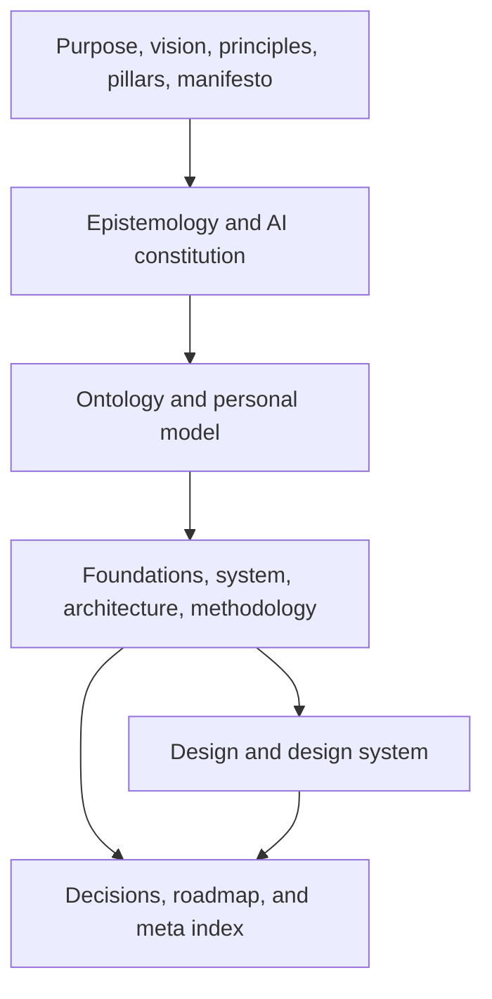

# Antidote repository architecture overview

This guide connects Antidote's canonical architecture corpus to the physical
repository. It is a navigation aid; [ARCHITECTURE.md](../ARCHITECTURE.md) owns
structural rules, [SYSTEM.md](../SYSTEM.md) owns logical responsibilities, and
[META.md](../META.md) owns the document graph.

## Structure map

| Path | Role | Current state |
| --- | --- | --- |
| Root architecture corpus | Purpose, epistemology, ontology, system, design, decisions, and roadmap | Provisional |
| `docs/decisions/` | Detailed architectural decision records | Implemented and expanding |
| `contracts/` | Cross-language schemas and executable model-worker protocol | Implemented foundation |
| `apps/desktop/` | Tauri desktop host and React interface | Executable synthetic session; packaging remains target |
| `crates/` | Framework-independent Rust core and adapters | Session core and persistence implemented; other adapters target |
| `workers/generation/` | Replaceable local Python model process | Deterministic mock implemented; real adapters target |
| `experiments/protocols/` | Frozen study definitions and analysis plans | Target |
| `research/` | Source verification, claim ledger, and working research records | Implemented |
| `data/` | Public schemas, synthetic fixtures, and approved derived study data only | Boundary implemented; no study data |
| `paper/` | Canonical LaTeX manuscript and bibliography | Implemented draft |
| `scripts/`, `latex/`, `themes/`, `web/` | Native publication implementation | Implemented |
| `docs/` and workflows | Public hub source, staging, checks, and gated deployment | Implemented |

## Architecture graph

The 18 root documents form one dependency graph:



`META.md` contains the canonical artifact inventory and exact upstream IDs.

## Runtime dependency direction

```text
React/Tauri interface
        ↓
application ports in Rust
        ↓
pure Antidote domain
        ↑
SQLite, filesystem, audio, worker, export, and future Ego Hygiene adapters
```

Adapters depend on inward-facing ports. The domain does not import a desktop
framework, database, Python model, provider, publication system, or sibling
repository.

## Canonical source and projections

| Concern | Canonical source | Derived projections |
| --- | --- | --- |
| Architecture identity | Root corpus and accepted ADRs | Diagrams, site pages, generated agent context |
| Cross-process payloads | `contracts/schemas/` | Rust, TypeScript, and Python types |
| Runtime history | Local events and classified payloads | Session views, working context, personal models, exports |
| Research claims | Source records, protocol, observations, and claim ledger | Manuscript, figures, magazine insights |
| Publication content | `paper/`, metadata, and project-owned build source | PDF, HTML, archive, manifests, Pages hub |

## Reflector reuse boundary

Reflector supplied a mature example of the Aether-shaped architecture corpus,
repository support files, deterministic publication separation, and human-
review discipline. Antidote reuses those patterns after specialization. It does
not copy Reflector's recursive-development ontology, CLI, paper content,
publication identity, DOI, version history, or source implementation.

Reusable publication tooling belongs to Beacon. Antidote retains its already
generated, project-owned build snapshot and immutable Beacon pin rather than
creating a runtime dependency on Reflector.

## First implementation slice

The active foundation sequence is implementing these layers incrementally:

1. choose and pin supported Rust, Node, Python, Tauri, and package-manager
   baselines;
2. create language workspaces without adding a real model;
3. generate or validate shared types from the canonical schemas;
4. implement a mock worker, then supervise it from Rust and compose the
   synthetic end-to-end session;
5. test consent rejection, invalid transitions, cancellation, partial output,
   negative response, and projection lineage;
6. compose checks behind the existing Make and Task interfaces.
