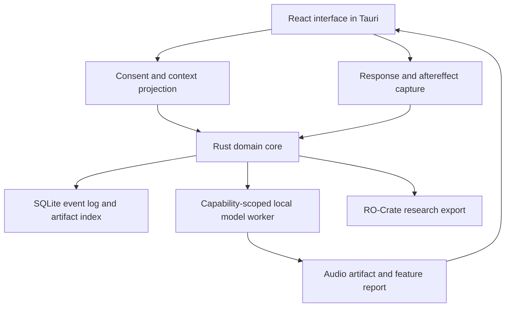

# Antidote Literature Voyage

## Annotated source atlas and research-framing notes — version 0.1

**Prepared:** 2026-08-27  
**Status:** Living research corpus; sources are candidates until promoted into the manuscript bibliography  
**Central question:** *Can an adaptive system learn an individual's mapping from interpretable sonic language, through generated acoustic structure, to affective response?*

## Purpose

This document is the first evidence-building pass for **Antidote**. It is intentionally broader than the final paper bibliography. It contains:

- sources likely to be cited directly;
- adjacent sources that help define the design space;
- counterevidence and methodological cautions;
- comparable systems needed for novelty analysis;
- technical references for a local prototype;
- ethical and safety references that constrain any health-related framing.

The paper should remain the scientific source of truth. The later magazine should translate its principal ideas into single-page visual insights without introducing claims absent from the paper.

## Evidence labels

| Label | Meaning | Appropriate use |
|---|---|---|
| **A — synthesis** | Systematic review, meta-analysis, or authoritative guidance | Establish the state of evidence and its limits |
| **B — primary** | Peer-reviewed empirical study | Support a bounded empirical statement |
| **C — system** | Peer-reviewed technical or design-system study | Establish feasibility or comparable architecture |
| **D — preprint** | Not yet peer reviewed | Identify frontier work; never treat as settled evidence |
| **E — contextual** | Company, institutional, regulatory, or conceptual source | Describe context, practice, governance, or an implementation environment |

## Initial conclusions

1. **Music can influence emotion, stress, memory, reward, attention, and physiological state, but the magnitude and direction depend on the listener, stimulus, context, and measurement method.** This supports personalization and repeated response capture more strongly than it supports a universal acoustic prescription.
2. **A state-transition design is scientifically plausible.** The iso principle—beginning near the listener's current state and moving toward a desired state—has preliminary experimental support and closely matches Antidote's journey model.
3. **Binaural beats belong in Antidote as an optional experimental control, not as a presumed mechanism.** Reviews report potentially useful behavioral outcomes, but EEG evidence for literal brainwave entrainment is inconsistent and methodologically heterogeneous.
4. **Music is a consequential part of psychedelic therapy's setting.** It can guide, support, intensify, or disrupt an experience. The evidence is meaningful but does not yet establish an optimal universal soundtrack or prove that music independently causes clinical improvement.
5. **Closed-loop adaptive music is already an active research frontier.** MindMelody is the nearest direct comparator; AffectMachine, BEAMERS, personalized affective music players, and LUCID-related work establish neighboring approaches.
6. **Antidote's contribution cannot simply be “EEG-driven closed-loop generated music.”** Its defensible differentiation is an interpretable personal sonic language, narrative/context inputs, an explicit affective journey, optional rather than mandatory physiology, longitudinal individual learning, local-first execution, and visible evidence boundaries.
7. **Technical controllability is not therapeutic efficacy.** Current generative models can follow text, melody, tempo, key, chord, and dynamic conditions with varying reliability; none thereby proves a health benefit.
8. **A prototype should initially be framed as a research and reflective-wellness instrument, not a medical treatment.** Clinical claims would require a separate protocol, ethics review, safety monitoring, appropriate expertise, and controlled human research.
9. **The most coherent first implementation is a local-first desktop research instrument.** A React interface inside a Tauri shell can call a Rust control plane and a capability-scoped Python model worker while keeping the event log, consent policy, artifacts, and personal model local and inspectable.

## Highest-priority reading voyage

Read these first, in order. Together they establish the closest prior art, core psychological model, strongest caution, and most relevant therapeutic context.

| Order | Source | Why it matters |
|---:|---|---|
| 1 | Zhang, Sun, and Gu, **“MindMelody: A Closed-Loop EEG-Driven System for Personalized Music Intervention”** (2026), [arXiv:2605.01235](https://arxiv.org/abs/2605.01235) — **D** | Nearest architectural comparator: EEG affect decoding → structured plan → controllable generation → feedback. Treat as a non-clinical preprint with important reporting questions, not therapeutic validation. |
| 2 | Agres, Dash, and Chua, **“AffectMachine-Classical”** (2023), [doi:10.3389/fpsyg.2023.1158172](https://doi.org/10.3389/fpsyg.2023.1158172) — **C** | Demonstrates real-time probabilistic generation targeted to valence and arousal; validates conveyed affect rather than health outcomes. |
| 3 | Janssen, van den Broek, and Westerink, **“Tune in to Your Emotions”** (2012), [doi:10.1007/s11257-011-9107-7](https://doi.org/10.1007/s11257-011-9107-7) — **C/B** | Longitudinal personalized affect modeling from biosignals and a listener's own music; strong precedent for within-person learning. |
| 4 | Mallik and Russo, **“The Effects of Music & Auditory Beat Stimulation on Anxiety”** (2022), [doi:10.1371/journal.pone.0259312](https://doi.org/10.1371/journal.pone.0259312) — **B** | Tests music, auditory beats, their combination, and a control; also operationalizes current-to-target affective sequencing through the iso principle. |
| 5 | Ingendoh, Posny, and Heine, **“Binaural Beats to Entrain the Brain?”** (2023), [doi:10.1371/journal.pone.0286023](https://doi.org/10.1371/journal.pone.0286023) — **A** | Essential counterweight: five included EEG studies supported entrainment, eight contradicted it, and one was mixed. |
| 6 | Juslin and Västfjäll, **“Emotional Responses to Music: The Need to Consider Underlying Mechanisms”** (2008), [doi:10.1017/S0140525X08005293](https://doi.org/10.1017/S0140525X08005293) — **A/conceptual** | Prevents simplistic feature-to-emotion claims by separating multiple mechanisms of music-evoked emotion. |
| 7 | Zentner, Grandjean, and Scherer, **“Emotions Evoked by the Sound of Music”** (2008), [doi:10.1037/1528-3542.8.4.494](https://doi.org/10.1037/1528-3542.8.4.494) — **B** | Establishes the Geneva Emotional Music Scale (GEMS), a richer response vocabulary than valence/arousal alone. |
| 8 | Kaelen et al., **“The Hidden Therapist”** (2018), [doi:10.1007/s00213-017-4820-5](https://doi.org/10.1007/s00213-017-4820-5) — **B** | Shows welcome and unwelcome roles of music in psilocybin therapy and links music experience with later outcomes, while remaining a small observational/qualitative study. |
| 9 | Rowe and Hurzeler, **“Psychedelic Therapy and the Role of Music”** (2026), [doi:10.1002/brb3.71533](https://doi.org/10.1002/brb3.71533) — **A** | Current scoping review: 19 quantitative studies and 330 total participants; highlights major gaps and inconsistent methods. |
| 10 | Silverman, Gooding, and Yinger, **“It's...Complicated: A Theoretical Model of Music-Induced Harm”** (2020), [doi:10.1093/jmt/thaa008](https://doi.org/10.1093/jmt/thaa008) — **A/conceptual** | Makes safety, user control, context, trauma sensitivity, and adverse-response capture first-class design requirements. |

## Closest prior systems and novelty map

| System | Inputs | Output | Feedback | Evidence status | Relationship to Antidote |
|---|---|---|---|---|---|
| **MindMelody** | EEG-derived global valence/arousal and local affect trajectory | Ten-second generated music through a structured intervention plan and MusicGen-based control | EEG plus subjective ratings | 2026 arXiv preprint; non-clinical pilot; no therapeutic validation | Closest comparator. Antidote must distinguish itself through personal semantic mappings, narrative context, optional physiology, longer-form journeys, longitudinal memory, and evidence-visible controls. |
| **AffectMachine-Classical** | Target valence/arousal | Rule-based probabilistic classical music | Listener validation; biofeedback proposed | Peer-reviewed system and listener study | Strong precedent for probability-space sculpting and interpretable musical parameters. |
| **BEAMERS** | Commercial EEG, song features, desired emotion variation | Personalized song recommendation | EEG and user reports | 2022 preprint | Precedent for individual variability and desired emotional change; recommends rather than generates music. |
| **Personalized Affective Music Player** | Peripheral physiology and personal music | Goal-directed selection from the listener's library | Repeated real-world biosignals | Peer-reviewed, multi-week evaluation | Strong precedent for within-person affective modeling and noisy real-world signals. |
| **LUCID-related anxiety study** | Self-reported current mood, target calm, musical preference | Algorithmically sequenced instrumental tracks; optional auditory beats | Pre/post anxiety and affect | Peer-reviewed randomized, open-label single-session study | Closely parallels current-state → desired-state sequencing but uses curated tracks rather than generative audio. |
| **Minimalist emotion-driven BCMI** | Prefrontal EEG / frontal alpha asymmetry | Stochastic music mapped to mode, tempo, density, and register | EEG neurofeedback | 2026 preprint; 22-person preliminary evaluation | Valuable negative result: target emotion did not reliably modulate the EEG control signal; individual differences explained more variance. |
| **Antidote (proposed)** | Self-report, explicit intent, personal sonic language, selected contextual text, history, and optional physiology | An interpretable, generated acoustic journey | Subjective response first; optional physiology; longitudinal personal model | Research proposal plus prototype to be built | Differentiation should center on meaning, inspectability, consent, trajectory, and individual learning—not the mere presence of generative AI or a feedback loop. |

### MindMelody due-diligence notes

MindMelody should be cited and treated seriously as the closest conceptual predecessor. It should not be treated as settled clinical evidence.

- It is an arXiv preprint, not a peer-reviewed clinical trial.
- It explicitly characterizes its own evaluation as a non-clinical pilot.
- It trains its EEG model on DEAP's 32-participant music-video dataset and uses a MusicGen-medium backbone.
- It reports a randomized within-subject pilot but the currently visible methods do not clearly report the pilot participant count.
- The paper page does not expose a code repository, clinical registration, or a conventional ethics statement.
- Its technical results are therefore useful for comparison and hypothesis formation; its claimed short-term intervention results need independent verification.

## Source cluster 1 — Music, affect, and psychophysiology

| Source | Evidence contribution | Antidote use / caution |
|---|---|---|
| Russell, **“A Circumplex Model of Affect”** (1980), [doi:10.1037/h0077714](https://doi.org/10.1037/h0077714) — **B** | Formalizes affect around pleasure/valence and arousal. | Useful shared coordinate system, but too coarse to represent all personally meaningful musical states. |
| Zentner, Grandjean, and Scherer (2008), [doi:10.1037/1528-3542.8.4.494](https://doi.org/10.1037/1528-3542.8.4.494) — **B** | Develops GEMS for music-evoked emotions. | Candidate response instrument and semantic vocabulary: wonder, transcendence, tenderness, nostalgia, peacefulness, power, joyful activation, tension, and sadness. |
| Juslin and Västfjäll (2008), [doi:10.1017/S0140525X08005293](https://doi.org/10.1017/S0140525X08005293) — **A/conceptual** | Separates mechanisms such as brain-stem reflexes, rhythmic entrainment, evaluative conditioning, emotional contagion, imagery, memory, expectancy, and appraisal. | The same acoustic feature can operate through different mechanisms for different people; the personal model should learn mechanism-relevant context, not only acoustic correlations. |
| Moore, **“A Systematic Review on the Neural Effects of Music on Emotion Regulation”** (2013), [doi:10.1093/jmt/50.3.198](https://doi.org/10.1093/jmt/50.3.198) — **A** | Synthesizes 50 studies; preferred and familiar music often produces more desirable emotion-regulation patterns, while complexity, dissonance, and surprise can be helpful or disruptive depending on context. | Supports personalization and conservative constraint shaping. |
| Chanda and Levitin, **“The Neurochemistry of Music”** (2013), [doi:10.1016/j.tics.2013.02.007](https://doi.org/10.1016/j.tics.2013.02.007) — **A** | Reviews reward, stress/arousal, immunity, and social-affiliation pathways while emphasizing weak or indirect evidence. | Use to motivate plausible mechanisms, not deterministic biochemical claims. |
| Salimpoor et al., **“Anatomically Distinct Dopamine Release…”** (2011), [doi:10.1038/nn.2726](https://doi.org/10.1038/nn.2726) — **B** | PET/fMRI evidence associates musical anticipation and peak pleasure with distinct striatal dopamine responses. | Supports temporally structured journeys and anticipation/arrival phases; it does not imply that any generated track will reproduce the effect. |
| Thoma et al., **“The Effect of Music on the Human Stress Response”** (2013), [doi:10.1371/journal.pone.0070156](https://doi.org/10.1371/journal.pone.0070156) — **B** | Randomized study across endocrine, autonomic, and subjective measures; relaxing music primarily influenced autonomic recovery, with mixed effects elsewhere. | Supports multidimensional response capture and warns against equating self-report, autonomic measures, and hormones. |
| Starcke et al., **“Emotion Modulation Through Music After Sadness Induction”** (2021), [doi:10.3390/ijerph182312486](https://doi.org/10.3390/ijerph182312486) — **B** | Controlled study broadly consistent with the iso principle: match the current state, then transition toward the desired state. | One of the clearest scientific anchors for Antidote's journey rather than destination framing. |
| Harney et al., **“Is Music Listening an Effective Intervention for Reducing Anxiety?”** (2023), [doi:10.1177/10298649211046979](https://doi.org/10.1177/10298649211046979) — **A** | Systematic review and meta-analysis of controlled studies of music listening and anxiety. | Use as higher-level efficacy context; inspect heterogeneity and intervention differences before extracting effect claims. |
| Kaiser and Berntsen, **“The Cognitive Characteristics of Music-Evoked Autobiographical Memories”** (2023), [doi:10.1002/wcs.1627](https://doi.org/10.1002/wcs.1627) — **A** | Reviews music-evoked autobiographical memory in clinical populations; familiarity often improves cueing. | Supports personal history and memory associations as meaningful inputs and potential risks. |
| Schubert, **“Emotion Felt by the Listener and Expressed by the Music”** (2013), [doi:10.3389/fpsyg.2013.00837](https://doi.org/10.3389/fpsyg.2013.00837) — **A** | Distinguishes music's expressed emotion from the emotion actually felt by the listener. | Antidote must measure listener response rather than infer success from the generated music's classifier label. |
| Lesaffre et al., **“How Potential Users…Describe the Semantic Quality of Music”** (2008), [doi:10.1002/asi.20731](https://doi.org/10.1002/asi.20731) — **B** | Finds affective, structural, and kinaesthetic descriptors shaped by age, expertise, familiarity, and other individual factors. | Direct support for a personal sonic language richer than genre tags. |
| Koelstra et al., **“DEAP”** (2012), [doi:10.1109/T-AFFC.2011.15](https://doi.org/10.1109/T-AFFC.2011.15) — **C/data** | Multimodal dataset of EEG, peripheral physiology, and ratings during music-video viewing. | Useful benchmark and schema reference; its small sample and elicitation setting do not solve personal real-world inference. |
| Li et al., **“EEG Based Emotion Recognition: A Tutorial and Review”** (2022), [doi:10.1145/3524499](https://doi.org/10.1145/3524499) — **A** | Reviews EEG affect-recognition pipelines, assumptions, and open challenges. | Supports treating EEG as optional and fallible, especially across people and changing contexts. |
| Large et al., **“Musical Neurodynamics”** (2025), [doi:10.1038/s41583-025-00915-4](https://doi.org/10.1038/s41583-025-00915-4) — **A/perspective** | Synthesizes synchronization, resonance, rhythm, meter, groove, and affect through a brain-body dynamical lens. | A more defensible account of musical synchronization than a simplistic “one frequency activates one brain area” model. |
| Leman, **“An Embodied Approach to Music Semantics”** (2010), [doi:10.1177/10298649100140S104](https://doi.org/10.1177/10298649100140S104) — **conceptual** | Treats the body as a mediator in musical meaning formation. | Supports embodied and phenomenological inputs without claiming they are reducible to one biometric signal. |

## Source cluster 2 — Binaural beats, auditory beats, and entrainment

| Source | Finding | Evidence-safe interpretation |
|---|---|---|
| Ingendoh, Posny, and Heine (2023), [doi:10.1371/journal.pone.0286023](https://doi.org/10.1371/journal.pone.0286023) — **A** | Fourteen EEG studies produced inconsistent results: five supportive, eight contradictory, one mixed. | The brainwave-entrainment hypothesis remains unresolved; standardization is needed. |
| Garcia-Argibay, Santed, and Reales, **“Efficacy of Binaural Auditory Beats…”** (2019), [doi:10.1007/s00426-018-1066-8](https://doi.org/10.1007/s00426-018-1066-8) — **A** | Meta-analysis of 22 studies reported an overall medium effect across cognition, anxiety, and pain, moderated by exposure design. | Suggestive behavioral evidence, but broad outcome pooling and study heterogeneity limit universal prescriptions. |
| Mallik and Russo (2022), [doi:10.1371/journal.pone.0259312](https://doi.org/10.1371/journal.pone.0259312) — **B** | Music plus theta-range auditory beat stimulation performed best on some anxiety outcomes for the moderate-trait-anxiety subgroup; effects were less differentiated for high trait anxiety. | A useful prototype study design with active comparators; it does not establish a universal theta treatment. |
| Elnazer, **“Music and Binaural Beat Interventions for Young Adults”** (2026), [doi:10.1017/neu.2026.10057](https://doi.org/10.1017/neu.2026.10057) — **A** | Reviews recent trials and reports small-to-moderate promise for sleep, anxiety, and stress-related regulation. | Recent synthesis for the extended bibliography; read its inclusion quality closely before relying on pooled conclusions. |
| Shaygan et al., **“Does Brain Entrainment Using Binaural Auditory Beats Affect Pain Perception?”** (2024), [doi:10.1186/s12906-024-04339-y](https://doi.org/10.1186/s12906-024-04339-y) — **A** | Risk of bias was commonly high and evidence quality low to very low; chronic-pain efficacy remained unclear. | Excellent example of why outcome promise and mechanistic certainty must be reported separately. |
| Muñoz and Rivera, **“Towards Improving Sleep Quality Using Automatic Sleep Stage Classification and Binaural Beats”** (2020), [doi:10.1109/EMBC44109.2020.9176385](https://doi.org/10.1109/EMBC44109.2020.9176385) — **C** | Proposes a real-time sleep-stage classifier connected to binaural-beat generation. | Comparable closed-loop architecture; largely proof-of-concept rather than clinical validation. |

### Required wording discipline

Prefer:

> Binaural beats are a psychoacoustic control whose behavioral effects and neural mechanisms remain under active investigation.

Avoid:

> A specific binaural frequency synchronizes the brain into a known therapeutic state.

## Source cluster 3 — Psychedelic and ketamine-assisted settings

| Source | Evidence contribution | Antidote use / caution |
|---|---|---|
| Kaelen et al. (2018), [doi:10.1007/s00213-017-4820-5](https://doi.org/10.1007/s00213-017-4820-5) — **B** | In 19 psilocybin-therapy patients, music could evoke meaning, imagery, guidance, openness, safety, resistance, or distress; the quality of music experience predicted one-week depression change. | Strong support for music as active setting and for capturing adverse or mismatched responses. Small, non-randomized evidence cannot isolate causal contribution. |
| Rowe and Hurzeler (2026), [doi:10.1002/brb3.71533](https://doi.org/10.1002/brb3.71533) — **A** | Scoping review of 19 quantitative studies (330 participants) finds preliminary effects on emotion, meaning/imagery networks, and neural entropy, alongside substantial methodological gaps. | Best current map of this literature and its uncertainty. |
| Adamska and Finc, **“Effect of LSD and Music on the Time-Varying Brain Dynamics”** (2023), [doi:10.1007/s00213-023-06394-8](https://doi.org/10.1007/s00213-023-06394-8) — **B** | Examines changing brain dynamics during LSD and music exposure. | Supports temporal rather than static models of experience; does not directly validate generated therapeutic music. |
| Hull et al., **“At-Home, Sublingual Ketamine Telehealth…”** (2022), [doi:10.1016/j.jad.2022.07.004](https://doi.org/10.1016/j.jad.2022.07.004) — **B/contextual** | Large prospective open-label effectiveness study associated a guided at-home ketamine program with symptom improvement. | Establishes real-world program context, not the independent effect of music, headphones, eye masks, or guidance. Company involvement and lack of randomized control must be explicit. |
| Mathai et al., **“At-Home, Telehealth-Supported Ketamine Treatment for Depression”** (2024), [doi:10.1016/j.jad.2024.05.131](https://doi.org/10.1016/j.jad.2024.05.131) — **B/contextual** | Longitudinal real-world outcome and symptom-network analysis of guided at-home care. | Useful for adaptive/longitudinal framing; cannot attribute outcomes to the auditory environment. |
| Parks et al., **“At-Home Telehealth-Supported Subcutaneous Ketamine Therapy…”** (2026), [doi:10.2196/92647](https://doi.org/10.2196/92647) — **B/contextual** | Retrospective cohort of a structured, monitored at-home program for depression, anxiety, and PTSD. | Program-level context only. The paper does not isolate or prominently report music as a causal factor. |

### Interpretation of lived experience

First-person experience can legitimately motivate the design question, identify neglected variables, and inform phenomenological requirements. It should be labeled as **design motivation or positional context**, not converted into proof of efficacy. The paper can remain impersonal if preferred while still allowing the system requirements—headphones, eyes-closed environment, safety, trajectory, resonance, and meaning—to reflect observations grounded in lived experience.

## Source cluster 4 — Generative and controllable audio

| Source | Capability | Prototype implication |
|---|---|---|
| Copet et al., **“Simple and Controllable Music Generation”** (2023), [arXiv:2306.05284](https://arxiv.org/abs/2306.05284) — **C** | MusicGen supports text and melody conditioning through an audio-token language model. | Practical local baseline and MindMelody comparator; model-weight licensing and hardware requirements need explicit audit. |
| Melechovsky et al., **“Mustango”** (2024), [doi:10.18653/v1/2024.naacl-long.459](https://doi.org/10.18653/v1/2024.naacl-long.459) — **C** | Adds explicit control over chords, beats, tempo, and key; releases MusicBench. | Especially aligned with Antidote's interpretable acoustic plan. Validate maintenance, weights, and licensing before adoption. |
| Liu et al., **“AudioLDM”** (2023), [PMLR 202](https://proceedings.mlr.press/v202/liu23f.html) — **C** | Latent-diffusion text-to-audio generation and zero-shot audio manipulation. | Useful for soundscape layers and non-musical acoustic elements. |
| Evans et al., **“Stable Audio Open”** (2024), [arXiv:2407.14358](https://arxiv.org/abs/2407.14358) — **C** | Open-weight text-to-audio model trained on Creative Commons data, optimized for short stereo audio. | Candidate local engine for textures, ambience, stems, and short structures. “Open weights” is not automatically OSI-open-source; inspect the community license. |
| Chen et al., **“MusicLDM”** (2023), [arXiv:2308.01546](https://arxiv.org/abs/2308.01546) — **D/C** | Text-to-music diffusion with beat-synchronous augmentation aimed at novelty and correspondence. | Useful design reference for diversity and training-data concerns. |
| Agostinelli et al., **“MusicLM”** (2023), [arXiv:2301.11325](https://arxiv.org/abs/2301.11325) — **D/C** | Hierarchical text-to-music generation and MusicCaps dataset. | Important technical history and dataset reference, but not an open local model baseline. |
| Tal et al., **“JASCO”** (2024), [arXiv:2406.10970](https://arxiv.org/abs/2406.10970) — **D/C** | Joint audio and symbolic conditioning for temporal control. | Highly relevant to storyboard-to-timeline realization. |
| Barnett, **“The Ethical Implications of Generative Audio Models”** (2023), [doi:10.1145/3600211.3604686](https://doi.org/10.1145/3600211.3604686) — **A** | Review of 884 papers finds negative impacts rarely discussed and identifies fraud, deepfakes, copyright, and other risks. | Requires provenance, license reporting, generated-audio disclosure, and careful training-data/model selection. |

### “Open source” acceptance criteria

The prototype should not call a model open source merely because its code or weights can be downloaded. Record separately:

- source-code license;
- model-weight license;
- training-data provenance and license;
- research-only or noncommercial restrictions;
- redistribution rights;
- local hardware requirements;
- support for deterministic seeds and provenance capture.

## Source cluster 5 — Context, journaling, and longitudinal state

| Source | Evidence contribution | Antidote use / caution |
|---|---|---|
| Bettis et al., **“Digital Technologies for Emotion-Regulation Assessment and Intervention”** (2022), [doi:10.1177/21677026211011982](https://doi.org/10.1177/21677026211011982) — **A/conceptual** | Reviews ecological momentary assessment, wearables, smartphones, acoustic/language data, and context-sensitive intervention. | Supports combining explicit self-report with selected context rather than pretending passive sensing can infer motive reliably. |
| Boemo et al., **“Relations Between Emotion Regulation Strategies and Affect in Daily Life”** (2022), [doi:10.1016/j.neubiorev.2022.104747](https://doi.org/10.1016/j.neubiorev.2022.104747) — **A** | Meta-analysis of experience-sampling and daily-diary studies emphasizes temporal, within-day relations between strategies and affect. | Supports longitudinal, event-level response logs and within-person learning. |
| Sohal et al., **“Efficacy of Journaling in the Management of Mental Illness”** (2022), [doi:10.1136/fmch-2021-001154](https://doi.org/10.1136/fmch-2021-001154) — **A** | Finds small-to-moderate potential benefit with high heterogeneity and methodological limitations. | Journaling may supply volunteered context; Antidote should not imply that mining journal text is itself therapeutic. |
| Kaiser and Berntsen (2023), [doi:10.1002/wcs.1627](https://doi.org/10.1002/wcs.1627) — **A** | Familiar music can rapidly evoke autobiographical memories, including negative material in depression. | Personal context can improve resonance and also increase harm; require preview, exclusions, and user control. |
| Lin et al., **“Context as an Environment: Programmatic Context Management for Long-Horizon Agents”** (2026), [arXiv:2608.21690](https://arxiv.org/abs/2608.21690) — **D/C** | Scroll separates a lossless append-only Event Log, durable payload storage, and a typed persistent namespace from the bounded working view shown to an LLM. A program selects what is materialized and exposed at query time. | Strong architectural reference for local longitudinal context and provenance. It is an AI-systems preprint, not evidence of health-data privacy, clinical safety, or correct psychological interpretation. |

### Context-ingestion constraint

The first prototype should use **explicitly selected excerpts or a user-written session brief**. It should not silently mine an entire journal or therapy history. A later Ego Hygiene module may offer opt-in summarization, but should preserve:

- consent at the level of each source;
- local processing by default;
- inspectable extracted themes;
- deletion and exclusion controls;
- a distinction between observed text, inferred state, and user-confirmed intent.

### Architectural implication — context as an environment

Scroll's session-state formalization can be adapted into an Antidote context substrate without adopting its implementation wholesale:

\[
S^{\mathrm{ctx}}_{i,t} = \left(L_{i,t},\;P_{i,t},\;V_{i,t}\right)
\]

| Component | Antidote interpretation |
|---|---|
| \(L_{i,t}\) — event log | Append-only, time-addressed records of check-ins, user selections, journey plans, generations, feedback, corrections, and exclusions. |
| \(P_{i,t}\) — durable payloads | Raw journal excerpts explicitly supplied for a session, generated audio, provenance manifests, and other large artifacts. |
| \(V_{i,t}\) — derived state | Typed, provenance-linked hypotheses about sonic language, response patterns, and longitudinal mappings. Derived interpretations never overwrite the original record. |
| \(c_{i,t}\) — working view | The small, inspectable projection permitted to shape the current journey. It is not the whole history. |

The current working context can be written as a policy-constrained projection:

\[
c^{\mathrm{work}}_{i,t}
=
\pi_{i,t}\!\left(S^{\mathrm{ctx}}_{i,t};\,A_{i,t}\right),
\qquad
\left|c^{\mathrm{work}}_{i,t}\right| \leq C
\]

where \(A_{i,t}\) is the person's current access-and-consent policy, \(\pi_{i,t}\) is the context-selection procedure, and \(C\) is the working-view budget. For Antidote, the projection should be visible and editable before generation. A technically recoverable history does not guarantee a psychologically relevant query: Scroll's reported failures include retrieving coherent evidence along the wrong preference axis. User confirmation therefore remains part of the control loop.

This paper should support the **software architecture and provenance rationale**, not any claim about emotional effectiveness. Its benchmark comparisons also require care because several reported memory-system baselines use different backbone models and evaluation configurations.

## Source cluster 6 — Safety, ethics, and medical boundaries

| Source | Constraint derived for Antidote |
|---|---|
| Silverman, Gooding, and Yinger (2020), [doi:10.1093/jmt/thaa008](https://doi.org/10.1093/jmt/thaa008) — **A/conceptual** | Music-induced harm can be affective, behavioral, cognitive, identity-related, interpersonal, physical, or spiritual. Capture negative response, stop/skip, intensity, and trigger-exclusion data. |
| World Health Organization, **“Ethics and Governance of Artificial Intelligence for Health”** (2021), [report](https://www.who.int/publications/i/item/9789240029200) — **E** | Preserve autonomy, transparency, accountability, inclusiveness, safety, and human control. |
| Haag et al., **“Ethical Gaps in Closed-Loop Neurotechnology”** (2025), [doi:10.1038/s41746-025-01908-4](https://doi.org/10.1038/s41746-025-01908-4) — **A** | Regulatory compliance alone is not meaningful ethical reflection; privacy, autonomy, justice, bias, explainability, and lived experience require explicit treatment. |
| Barnett (2023), [doi:10.1145/3600211.3604686](https://doi.org/10.1145/3600211.3604686) — **A** | Add audio provenance, model/license manifests, and abuse/copyright analysis. |
| FDA, **“Clinical Decision Support Software”** (2026), [guidance](https://www.fda.gov/regulatory-information/search-fda-guidance-documents/clinical-decision-support-software) — **E** | Patient-facing software that claims to diagnose, prevent, mitigate, or treat disease may enter medical-device territory. Prototype wording and intended use matter. |
| Mindbloom research and safety information, [research page](https://www.mindbloom.com/research) — **E** | Useful real-world protocol and risk context; it is not independent evidence that music causes ketamine outcomes. Keep commercial claims separate from peer-reviewed papers. |

## Source cluster 7 — Buildable architecture and research infrastructure

This cluster deliberately combines three different kinds of material:

- **research and design papers**, which can support architectural reasoning in the manuscript;
- **standards and specifications**, which define interoperable records and provenance;
- **implementation frameworks**, which belong in the prototype dossier or extended bibliography rather than being presented as scientific evidence.

### Context, memory, and local ownership

| Source | Architectural contribution | Antidote decision / caution |
|---|---|---|
| Sumers et al., **“Cognitive Architectures for Language Agents”** (2023), [arXiv:2309.02427](https://arxiv.org/abs/2309.02427) — **C/conceptual** | CoALA separates modular memory, internal and external action spaces, and decision processes. | Use as a vocabulary for separating episodic session history, semantic personal mappings, procedural generation policies, and the current working state. It is a conceptual framework, not an implementation or health-system validation. |
| Packer et al., **“MemGPT: Towards LLMs as Operating Systems”** (2023), [arXiv:2310.08560](https://arxiv.org/abs/2310.08560) — **D/C** | Uses operating-system-inspired memory tiers and virtual context management for extended conversations. | Supports bounded working context and explicit movement between memory tiers. Prefer Scroll's lossless record for ground truth; derived summaries should remain replaceable views. |
| Chhikara et al., **“Mem0”** (2025), [arXiv:2504.19413](https://arxiv.org/abs/2504.19413) — **D/C** | Extracts, consolidates, and retrieves salient conversational memory, including a graph-memory variant. | Useful comparator for compact personalized memory. Its extract-at-ingestion strategy can omit future-relevant details, so Antidote should preserve raw consented events beside derived memories. |
| Kleppmann et al., **“Local-First Software: You Own Your Data, in spite of the Cloud”** (2019), [doi:10.1145/3359591.3359737](https://doi.org/10.1145/3359591.3359737) — **C/conceptual** | Establishes local ownership, offline availability, longevity, user control, and optional servers in a supporting rather than authoritative role. | The prototype's source of truth should be local files plus SQLite. Cloud synchronization, if ever added, should be optional and encrypted rather than required for ordinary use. Local-first does not eliminate backup, device-security, or key-management risks. |

### Desktop host, storage, and process boundaries

| Source or system | Architectural contribution | Antidote decision / caution |
|---|---|---|
| Tauri 2, [official documentation](https://v2.tauri.app/) and [sidecar guide](https://v2.tauri.app/develop/sidecar/) — **E/implementation** | Combines a web interface with a Rust application core and can bundle external binaries as sidecars. Its capability system scopes which windows and webviews may invoke commands or run sidecars. | Use as the v0 desktop host: React for interaction, Rust for local authority, and a permission-scoped Python worker for model inference. Treat Tauri as an implementation choice, not scientific evidence. Pin the sidecar binary, constrain arguments, and expose only a narrow typed protocol. |
| SQLite, [WAL documentation](https://www.sqlite.org/wal.html) and [FTS5 documentation](https://www.sqlite.org/fts5.html) — **E/implementation** | Provides transactional local persistence, write-ahead logging, and deterministic full-text search without a separate database service. | Use for the append-only event log, consent records, derived projections, run metadata, and lexical retrieval. Store large audio as content-addressed files. SQLite is not encrypted by default; encryption, backups, key recovery, and deletion semantics remain explicit security work. |
| Candle, [official repository](https://github.com/huggingface/candle) — **E/implementation** | Rust-native machine-learning framework with GPU support and ONNX evaluation. | Keep as a future route for small classifiers, embeddings, or converted models. Do not force the primary audio generator into Rust until operator coverage, numerical behavior, and model conversion have been verified. |

### Moment-specific adaptation and evaluation architecture

| Source | Architectural contribution | Antidote decision / caution |
|---|---|---|
| Nahum-Shani et al., **“Just-in-Time Adaptive Interventions in Mobile Health”** (2018), [doi:10.1007/s12160-016-9830-8](https://doi.org/10.1007/s12160-016-9830-8) — **A/conceptual** | Defines distal and proximal outcomes, decision points, intervention options, tailoring variables, and decision rules for adapting support to changing state and context. | This is the clearest scientific architecture for Antidote's “this person, in this moment” claim. Translate intervention options into journey strategies without claiming the generated audio is a treatment. |
| Qian et al., **“The Micro-Randomized Trial for Developing Digital Interventions”** (2021), [arXiv:2107.03544](https://arxiv.org/abs/2107.03544) — **A/method** | Provides experimental and analytical methods for estimating when and under which circumstances time-varying components help. | Future multi-session studies can randomize bounded journey components; v0 should only build the logging and assignment hooks, not pretend an informal session history is an MRT. |
| Greenewald et al., **“Action Centered Contextual Bandits”** (2017), [arXiv:1711.03596](https://arxiv.org/abs/1711.03596) — **C/method** | Separates a potentially complex baseline reward from a simpler, interpretable treatment effect for non-stationary mobile-health decisions. | Strong future adaptation model because it does not confuse a person's naturally changing baseline with the effect of an audio choice. Do not enable autonomous online optimization in v0: sparse subjective rewards and safety-sensitive exploration make premature bandits inappropriate. |
| Konigorski et al., **“StudyU”** (2022), [doi:10.2196/35884](https://doi.org/10.2196/35884) — **C/system** | Open-source platform for designing and conducting digital N-of-1 trials. | Reference its separation of study design, participant experience, assignments, measurements, and export. Antidote's first credible evaluation should be repeated-measures N-of-1, not a one-session demonstration. |

### Generative audio, analysis, and realization

| Source or system | Architectural contribution | Antidote decision / caution |
|---|---|---|
| Gong et al., **“ACE-Step 1.5”** (2026), [arXiv:2602.00744](https://arxiv.org/abs/2602.00744) and [official model card](https://huggingface.co/ACE-Step/Ace-Step1.5) — **D/C + implementation** | Hybrid language-model planner and diffusion-transformer generator; supports local generation, 10-second to 10-minute duration, BPM, key, time signature, reference audio, editing, and lightweight adaptation. The official model card identifies the model as MIT licensed. | **Primary v0 generator candidate.** Its planner/blueprint split resembles Antidote's semantic-journey-plan split. Audit `trust_remote_code`, model revisions, training-data claims, output rights, deterministic behavior, and actual consumer-hardware performance before adoption. |
| Copet et al., **MusicGen / AudioCraft** (2023), [arXiv:2306.05284](https://arxiv.org/abs/2306.05284) and [official repository](https://github.com/facebookresearch/audiocraft) — **C + implementation** | Well-documented controllable baseline with textual and melodic conditioning, training code, and a mature research lineage. | Keep as a comparator and fallback adapter. AudioCraft code is MIT, but official model weights are CC-BY-NC 4.0, so do not make them the default for a potentially commercial Ego Hygiene module. |
| McFee et al., **“librosa: Audio and Music Signal Analysis in Python”** (2015), [doi:10.25080/Majora-7b98e3ed-003](https://doi.org/10.25080/Majora-7b98e3ed-003) — **C/implementation** | Widely used building blocks for tempo, spectral, rhythmic, harmonic, and time-series audio analysis. | Preferred permissive analysis layer for prototype feature extraction and control-adherence checks inside the Python worker. Pin versions and record parameters. |
| Bogdanov et al., **“Essentia: An Open-Source Library for Audio Analysis”** (2013), [doi:10.1145/2502081.2502229](https://doi.org/10.1145/2502081.2502229) — **C/implementation** | Extensive C++/Python/JavaScript algorithms for spectral, temporal, tonal, and high-level music descriptors. | Excellent benchmark and validation toolbox. Its AGPL licensing requires review before it is bundled into a distributable application; it can remain a research-only evaluation dependency. |
| W3C, **Web Audio API** (2024), [Recommendation](https://www.w3.org/TR/webaudio-1.1/) — **E/specification** | Standard node graph for playback, gain, filtering, timing, visualization, and spatialization; AudioWorklet supports custom low-latency processing. | Use in the React/Tauri interface for preview, fades, spatialization, and an optional beat layer. Preserve an offline rendered master so a browser audio graph is not the sole research artifact. |
| RustAudio, **CPAL / Rodio** — [CPAL](https://github.com/RustAudio/cpal), [Rodio](https://github.com/RustAudio/rodio) — **E/implementation** | Cross-platform Rust audio I/O and higher-level playback. | Candidate for stable native playback or export if Web Audio behavior differs across webviews. Do not build two playback engines until a real cross-platform problem justifies it. |

### Optional physiology boundary

| Source | Architectural contribution | Antidote decision / caution |
|---|---|---|
| Kothe et al., **“The Lab Streaming Layer for Synchronized Multimodal Recording”** (2025), [doi:10.1162/IMAG.a.136](https://doi.org/10.1162/IMAG.a.136) — **B/C** | Provides time synchronization, per-sample timestamps, recovery, and recording across heterogeneous behavioral and neurophysiological streams. | Define a future `SensorStream` adapter around LSL timestamps rather than coupling the core to any EEG or wearable vendor. Sensors remain absent from v0 and optional thereafter. |
| Chen et al., **“Making Sense of Mobile Health Data”** (2012), [doi:10.2196/jmir.2152](https://doi.org/10.2196/jmir.2152), plus [Open mHealth schemas](https://github.com/openmhealth/schemas) — **C/conceptual + specification** | Proposes an open architecture and reusable schemas for structured mobile-health data. | Use established schemas where they genuinely fit; define Antidote-specific state and response types separately rather than forcing subjective experience into a clinical sensor schema. |

### Provenance, reproducibility, and model governance

| Source or standard | Architectural contribution | Antidote decision / caution |
|---|---|---|
| W3C, **PROV-DM** (2013), [Recommendation](https://www.w3.org/TR/prov-dm/) — **E/specification** | Models entities, activities, agents, derivations, and generation relationships. | Use its conceptual vocabulary in the internal provenance graph: a run used a model and journey plan, generated an audio artifact, and was associated with a local user-controlled session. |
| Leo et al., **“Recording Provenance of Workflow Runs with RO-Crate”** (2024), [doi:10.1371/journal.pone.0309210](https://doi.org/10.1371/journal.pone.0309210) — **B/C** | Packages workflow definitions, executions, inputs, outputs, code, and metadata in interoperable JSON-LD research objects. | Make each shareable experiment export an RO-Crate. This can connect Antidote runs directly to the paper's reproducibility bundle and future Beacon/Renderflow outputs. |
| Mitchell et al., **“Model Cards for Model Reporting”** (2019), [doi:10.1145/3287560.3287596](https://doi.org/10.1145/3287560.3287596) — **A/conceptual** | Defines transparent reporting of intended use, performance, limitations, and evaluation conditions. | Maintain an adapter/model card for every supported generator and analyzer, including license, revision, hardware, controls, known failures, and prohibited claims. |
| C2PA, **Technical Specification 2.4** (2026), [specification](https://spec.c2pa.org/specifications/specifications/2.4/specs/C2PA_Specification.html) — **E/specification** | Defines signed provenance manifests and content bindings for media assets. | Potential future export feature, not the internal source of truth. Independent analysis has identified shortcomings for high-stakes verification; hashes, event provenance, and RO-Crate remain necessary even if C2PA credentials are added. |
| Golaszewski et al., **“Verifying Provenance of Digital Media: Why the C2PA Specifications Fall Short”** (2026), [arXiv:2604.24890](https://arxiv.org/abs/2604.24890) — **D/security** | Independent formal and security analysis argues that C2PA does not yet achieve several claimed or necessary high-stakes security goals. | Prevents the paper from equating a content credential with truth, authorship, consent, or clinical validity. |
| Hugging Face, **Safetensors** — [documentation](https://huggingface.co/docs/safetensors/index) — **E/implementation** | Non-executable, fast tensor storage intended to avoid pickle-style code execution during weight deserialization. | Prefer safetensors weights, pin hashes and revisions, and still audit model repositories and any required `trust_remote_code`; a safe weight container does not make arbitrary accompanying code safe. |

### Concrete v0 topology



Recommended repository boundaries:

```text
apps/
  desktop/                 # Tauri 2 shell + React interface
crates/
  antidote-core/           # state, journey, decision, safety, and adaptation types
  antidote-store/          # append-only events, projections, payload references
  antidote-provenance/     # hashes, manifests, model cards, RO-Crate export
  antidote-audio/          # playback/export abstractions; no model implementation
workers/
  generation/              # Python/PyTorch process with replaceable model adapters
contracts/
  schemas/                 # versioned JSON Schema shared across Rust, TypeScript, Python
experiments/
  protocols/               # N-of-1 conditions, assignment plans, measurement definitions
```

The Rust core should be framework-independent. Tauri is the v0 host; an Axum API can later wrap the same core for Ego Hygiene integration without moving the local source of truth into a web service.

### Minimal model-worker contract

The sidecar boundary should expose a small versioned protocol rather than model-specific Python calls:

| Operation | Purpose |
|---|---|
| `hello` | Negotiate protocol version and worker identity. |
| `capabilities` | Report installed adapters, controls, licenses, hardware, and supported durations. |
| `load_model` | Load a pinned model ID and revision after integrity checks. |
| `generate` | Accept an immutable `GenerationSpec`; stream progress; return artifacts and warnings. |
| `analyze` | Measure tempo, key, duration, loudness, spectral features, and requested control adherence. |
| `cancel` | Cooperatively stop a running job and clean partial outputs. |
| `health` | Report readiness, device memory, and active jobs without exposing personal content. |

The worker should receive the **approved semantic projection and journey plan**, not unrestricted journal or therapy history. Every result should include model ID, revision, code revision, seed, generation parameters, elapsed time, device class, input-plan hash, output hashes, and warnings.

### Local persistence model

| Record | Function |
|---|---|
| `events` | Immutable, ordered facts about user and system actions. |
| `payloads` | Content-addressed references to large or sensitive local artifacts. |
| `consent_grants` | Source-, purpose-, and session-scoped permission records. |
| `projections` | Versioned, inspectable derived context with source-event provenance. |
| `journey_plans` | Human-readable intended trajectories and acoustic controls. |
| `generation_runs` | Immutable model invocation specifications and runtime results. |
| `artifacts` | Audio, waveform, analysis, hash, format, and provenance metadata. |
| `responses` | State measurements, felt response, helpfulness, intensity, mismatch, harm, and later aftereffect. |
| `model_snapshots` | Versioned personal mapping estimates with the evidence that changed them. |

SQLite is sufficient for v0: transactions preserve state changes, FTS5 supports deterministic lexical recovery, and large audio remains in a content-addressed filesystem rather than database blobs. Encryption, backups, key recovery, and secure deletion require explicit design before sensitive context moves beyond a developer-only prototype.

### Adaptation maturity ladder

1. **Rule-guided v0:** explicit user state, user-chosen journey, inspectable plan, no autonomous optimization.
2. **Descriptive N-of-1:** repeated sessions estimate within-person patterns without choosing interventions automatically.
3. **Advisory model:** rank a few journey strategies with uncertainty; the person selects or edits one.
4. **Constrained adaptation study:** pre-registered randomization or a carefully bounded contextual-bandit policy with safety and stop rules.
5. **Optional multimodal research:** synchronized physiological streams through a vendor-neutral adapter such as LSL.

This ladder prevents “closed-loop” from becoming a euphemism for unvalidated autonomous experimentation.

## Claim-strength matrix for the manuscript

| Candidate claim | Current confidence | Evidence-safe manuscript treatment |
|---|---|---|
| Music can alter subjective affect and aspects of stress physiology. | **Moderate** | State with heterogeneity and context dependence. |
| Preferred, familiar, and personally resonant music often differs from generic music in its effects. | **Moderate** | Use to justify personalization; avoid promising positive response. |
| A current-state-to-desired-state sequence can support emotion modulation. | **Preliminary to moderate** | Present the iso principle as a design anchor requiring further validation. |
| Specific acoustic parameters map universally to specific emotions. | **Low** | Reject as a universal claim; treat mappings as probabilistic and person-specific. |
| Binaural beats reliably entrain brain oscillations at the beat frequency. | **Unresolved** | Present as a disputed hypothesis. |
| Binaural or auditory beats may influence anxiety, cognition, sleep, or pain. | **Suggestive** | Report outcomes and methodological limitations separately from the entrainment mechanism. |
| Music meaningfully shapes psychedelic experiences. | **Moderate, mostly small/heterogeneous studies** | Discuss music as an active setting variable; do not claim an optimized causal treatment. |
| Text-to-music systems can follow semantic and musical controls. | **Moderate technical evidence** | Support prototype feasibility, not therapeutic effect. |
| EEG can provide a universal objective measure of emotion. | **Low** | Treat EEG as noisy, model-dependent, context-sensitive, and optional. |
| A closed-loop personalized generative system improves mental-health outcomes. | **Unproven** | State as Antidote's research hypothesis. |
| Journal or therapy-chat context can improve generated-session relevance. | **Unproven but design-plausible** | Evaluate consent, perceived relevance, and response; do not infer diagnosis from text. |

## Proposed paper identity

Antidote v0.1 is best framed as a **design-science and research-vision paper with a transparent local prototype**, not as a clinical efficacy paper.

### Candidate contribution statement

Antidote contributes:

1. an interpretable semantic layer that lets a person define a personal sonic language rather than accept population-average emotion labels;
2. a trajectory model that converts current state, desired transition, constraints, and meaning into a staged acoustic journey;
3. a local-first, model-adapter architecture that separates intent planning from audio realization and preserves provenance;
4. a longitudinal response model that learns within-person mappings from explicitly captured experience;
5. an evidence-disciplined evaluation framework that separates acoustic adherence, perceived emotion, felt response, usefulness, harm, and therapeutic claims.

### Candidate paper type and section emphasis

| Section | Primary job |
|---|---|
| Abstract | State the system question, contribution, prototype, and non-clinical boundary. |
| Introduction | Explain the gap between static music selection, opaque generation, and personally interpretable affective journeys. |
| Related work | Compare music psychology, adaptive systems, auditory beats, psychedelic setting, affective computing, and generative audio. |
| Methodology / design | Define state, transition, semantic intent, storyboard, acoustic realization, response capture, and adaptation. |
| Prototype | Demonstrate local execution and end-to-end inspectability; do not call the demo a treatment. |
| Evaluation | Test control adherence, semantic coherence, usability, felt-vs-expressed emotion, and single-user repeatability. |
| Discussion | Explain scientific plausibility, prior-art boundaries, and possible Ego Hygiene integration. |
| Limitations | No clinical inference, small or N-of-1 evaluation, model/license limits, subjective measurement, safety, and generalization. |
| Conclusion | Reiterate the research program rather than claiming efficacy. |

## Prototype implication — recommended architecture

The preferred v0 is a **Tauri 2 local desktop application**. React owns interaction design, Rust owns the control plane and local source of truth, and an isolated model worker owns inference.

```text
Tauri desktop shell
    ↓
React interface and consent-aware context selector
    ↓
Rust domain core, session orchestrator, and append-only event log
    ↓
Typed derived state and inspectable working projection
    ↓
Semantic-intent and journey plan
    ↓
Capability-scoped local model sidecar / inference worker
    ↓
Audio assembly, playback, and provenance
    ↓
Response capture and personal model update
```

### Why not force inference into pure Rust initially

Most viable open-weight audio-generation stacks remain centered on Python, PyTorch, CUDA, and model-specific preprocessing. Reimplementing them in Rust would consume the research project with inference plumbing and reduce reproducibility. The backend can still be unambiguously Rust:

- **Rust domain and control plane:** Tauri commands in v0, with an optional Axum wrapper later; session state machine, consent policy, append-only event log, durable artifact references, typed derived state, working-view construction, validation, schema/version management, local database, jobs, provenance, audio metadata, safety constraints, and progress events.
- **Desktop host:** Tauri 2 command and capability layer. The Rust domain core should remain reusable outside Tauri.
- **Model worker:** replaceable local process or localhost service; begin with an ACE-Step 1.5 adapter and retain MusicGen, Mustango, AudioLDM, or Stable Audio Open adapters for comparison. Consider ONNX/Candle only when required operators and model conversions are verified.
- **React:** current-state capture, consented-context preview, semantic-language editor, journey storyboard, generation progress, player, and post-session response instruments.

This boundary also makes model comparisons and later model replacement scientifically cleaner.

## Prototype v0 scope

### In scope

- manual current-state check-in;
- desired transition and time horizon;
- user-authored semantic descriptors, metaphors, inclusions, and exclusions;
- optional explicitly pasted journal/session context;
- visible structured journey plan before generation;
- one local audio-model adapter plus deterministic provenance;
- before/after valence-arousal plus GEMS-9-style response capture;
- free-text notes, perceived helpfulness, mismatch, and adverse-response capture;
- local session history and simple within-person preference updates;
- experimental binaural/isochronic layer behind an explicit toggle and evidence notice.

### Out of scope for v0

- diagnosis or treatment recommendations;
- autonomous analysis of an entire therapy history;
- real-time EEG control;
- claims of neural entrainment;
- unsupervised ketamine or psychedelic-session guidance;
- clinical outcome claims;
- multi-participant generalization;
- opaque automatic changes that the user cannot inspect or override.

## Suggested first evaluation

A small **N-of-1 repeated-session feasibility study** is more aligned with Antidote's central claim than a premature population model.

For each session, record:

1. current affect and desired transition;
2. semantic intent and journey plan;
3. model, seed, parameters, and generated artifact hash;
4. plan-adherence ratings for tempo, timbre, density, harmony, and spatiality;
5. perceived emotion and actually felt emotion as separate measures;
6. post-session affect, helpfulness, resonance, surprise, mismatch, and harm;
7. what the adaptation model changes for the next session.

Compare at least:

- generic text prompt;
- structured but non-personalized journey;
- personal semantic journey;
- optionally, the personal journey with an auditory-beat layer.

This evaluates whether the semantic layer and adaptation loop add value without pretending to establish medical efficacy.

## Research gaps Antidote can explicitly target

- The gap between population-level emotion labels and a person's idiosyncratic sonic meanings.
- The gap between a target emotion and a temporally structured transition toward it.
- The gap between the emotion expressed by generated music and the emotion felt by its listener.
- The gap between opaque end-to-end generation and inspectable intent/acoustic controls.
- The gap between one-off preference and longitudinal within-person learning.
- The gap between technical closed loops and ethically meaningful user agency.
- The gap between evocative psychedelic-session music practice and evidence-based personalization.

## Bibliography promotion rules

A candidate moves from this source atlas into the canonical `.bib` only after:

- title, author list, year, venue, and DOI/arXiv identifier are verified against a primary record;
- source type and peer-review status are recorded;
- the paper or full abstract has been read, not merely a secondary summary;
- the specific claim it may support is written down;
- limitations and conflicts of interest are captured;
- duplicates and preprint/version-of-record pairs are reconciled;
- the citation key follows the project's naming convention;
- “background only” sources remain allowed but are tagged as uncited or extended reading.

## Next research passes

1. **MindMelody dossier:** read the full current version, trace every comparable-system citation, inspect methods/reporting, and build a claim-by-claim comparison.
2. **Music psychology deepening:** map BRECVEMA mechanisms, GEMS, iso principle, preference/familiarity, memory, and felt-vs-expressed emotion to Antidote fields.
3. **Psychedelic-setting dossier:** extract music-selection practices, temporal arcs, welcome/unwelcome effects, safety music, and reporting gaps.
4. **Beat and entrainment dossier:** separate psychoacoustic perception, EEG entrainment, behavioral outcomes, and marketing claims.
5. **Prototype model audit:** benchmark local models for license, hardware, duration, temporal control, determinism, and acoustic-feature adherence.
6. **Measurement protocol:** choose minimal pre/post instruments and distinguish research logging from clinical assessment.
7. **Verified bibliography:** promote the first high-priority sources into BibTeX with claim and section tags.

## Working thesis

Antidote is strongest when described not as a machine that knows which sound will heal someone, but as an interpretable research system for learning how a particular person experiences mappings among meaning, acoustic structure, affective trajectory, and response.

That shift preserves the ambition while making the research question testable, the prototype buildable, and the claims scientifically honest.

## Architecture-evidence addendum — adaptive control and real-time audio

Issue #33 extends the atlas with a governed architecture dossier and a
machine-readable source-to-subsystem map:

- [Adaptive-control and real-time generative-audio architecture](../notes/ADAPTIVE_AUDIO_ARCHITECTURE.md)
- [Architecture evidence map](../sources/architecture-evidence-map.json)

The central result is a **proposed two-rate, generate-ahead architecture**. A
slow control loop maintains an uncertain, person-correctable state belief,
mixes explicit high-level intent controls, and revises a short future journey.
A deterministic audio loop schedules verified material and owns waveform-level
continuity. This is an evidence-grounded design synthesis, not an implemented
MVP capability or a therapeutic claim.

### Architecture source cluster

| Source | Class | Antidote mapping and boundary |
| --- | --- | --- |
| Nahum-Shani et al. (2018), [doi:10.1007/s12160-016-9830-8](https://doi.org/10.1007/s12160-016-9830-8) | Scientific precedent | Decision points, tailoring variables, intervention options, proximal outcomes, and explicit decision rules; not proof of an effective audio intervention. |
| García, Prett, and Morari (1989), [doi:10.1016/0005-1098(89)90002-2](https://doi.org/10.1016/0005-1098(89)90002-2) | Speculative transfer | Receding-horizon prediction and constrained replanning; affect is not assumed to be a known plant. |
| Kaelbling, Littman, and Cassandra (1998), [doi:10.1016/S0004-3702(98)00023-X](https://doi.org/10.1016/S0004-3702(98)00023-X) | Speculative transfer | Belief-state planning under partial observation; v0 does not implement an autonomous POMDP policy. |
| Jain and Argall (2019), [doi:10.1145/3359614](https://doi.org/10.1145/3359614) | Speculative transfer | Recursive Bayesian fusion of multiple observations while retaining uncertainty; robot intent is not affect. |
| Amershi et al. (2014), [doi:10.1609/aimag.v35i4.2513](https://doi.org/10.1609/aimag.v35i4.2513) | Scientific precedent | Involve people in interactive-learning design and correction; feedback remains fallible and burdensome. |
| Honeycutt, Nourani, and Ragan (2020), [doi:10.1609/hcomp.v8i1.7464](https://doi.org/10.1609/hcomp.v8i1.7464) | Conflicting evidence | In one controlled study, soliciting feedback reduced trust and perceived accuracy; more controls are not automatically better. |
| De Angel et al. (2022), [doi:10.1038/s41746-021-00548-8](https://doi.org/10.1038/s41746-021-00548-8) | Qualifying evidence | Passive monitoring literature has missingness, reproducibility, sample, and generalization problems; sensors remain optional observations. |
| D'Amelio et al. (2025), [doi:10.1016/j.neucom.2025.130831](https://doi.org/10.1016/j.neucom.2025.130831) | Mixed evidence | EDA models are stronger for arousal than valence and often mismatch continuous theory with discrete classifiers; no objective emotion decoder. |
| Melechovsky et al. (2024), [doi:10.18653/v1/2024.naacl-long.459](https://doi.org/10.18653/v1/2024.naacl-long.459) | Scientific precedent | Explicit chord, beat, tempo, and key conditioning supports typed mixins and adherence tests; not continuous live steering. |
| Tal et al. (2024), [arXiv:2406.10970](https://arxiv.org/abs/2406.10970) | Emerging system | Global text plus time-local symbolic/audio conditions support the storyboard-to-timeline concept; not verified real-time generation. |
| Wang, Bao, and Han (2026), [arXiv:2606.24307](https://arxiv.org/abs/2606.24307) | Emerging system | Proposes chunk-wise interactive streaming and temporal-consistency losses; new preprint with no Antidote replication or production audit. |
| Hutchings and McCormack (2020), [doi:10.1109/TG.2019.2921979](https://doi.org/10.1109/TG.2019.2921979) | Scientific precedent | Context-responsive, real-time adaptive composition exists in games; gameplay immersion does not establish affective benefit. |
| W3C, [Web Audio API 1.1](https://www.w3.org/TR/webaudio-1.1/) | Normative standard | Scheduled parameter automation and render-thread concepts anchor waveform continuity; citation does not claim Antidote conformance. |
| EBU, [R 128](https://tech.ebu.ch/publications/r128) | Normative standard | Loudness measurement and normalization anchor one continuity feature; not a universal listening or safety level. |
| AWS, [Event Sourcing Pattern](https://docs.aws.amazon.com/prescriptive-guidance/latest/cloud-design-patterns/event-sourcing-pattern.html) | Implementation guidance | Append-only events and replayable state are established engineering patterns; not scientific or privacy evidence. |

Existing sources complete the neighboring architecture shelf: Lab Streaming
Layer ([doi:10.1162/IMAG.a.136](https://doi.org/10.1162/IMAG.a.136)) for
synchronized optional streams; local-first software
([doi:10.1145/3359591.3359737](https://doi.org/10.1145/3359591.3359737)) for
local data ownership; Scroll ([arXiv:2608.21690](https://arxiv.org/abs/2608.21690))
for bounded working projections; [W3C PROV-DM](https://www.w3.org/TR/prov-dm/)
for interoperable lineage; and Workflow Run RO-Crate
([doi:10.1371/journal.pone.0309210](https://doi.org/10.1371/journal.pone.0309210))
for reproducible workflow packaging.

### Architecture boundary preserved

- Physiological and behavioral inputs are consented observations with
  uncertainty, alternatives, missingness, and person correction.
- High-level knobs become typed, versioned semantic mixins; they do not bypass
  exclusions, consent, or the reviewed journey plan.
- The controller predicts only far enough ahead to preserve a verified buffer
  and smooth journey evolution.
- Semantic continuity and waveform continuity are measured separately.
- When latency or uncertainty increases, stability, confirmation, fallback, or
  stop take precedence over novelty.
- No source in this cluster proves efficacy, diagnosis, neurological mechanism,
  real-time MVP behavior, or autonomous personalization.
