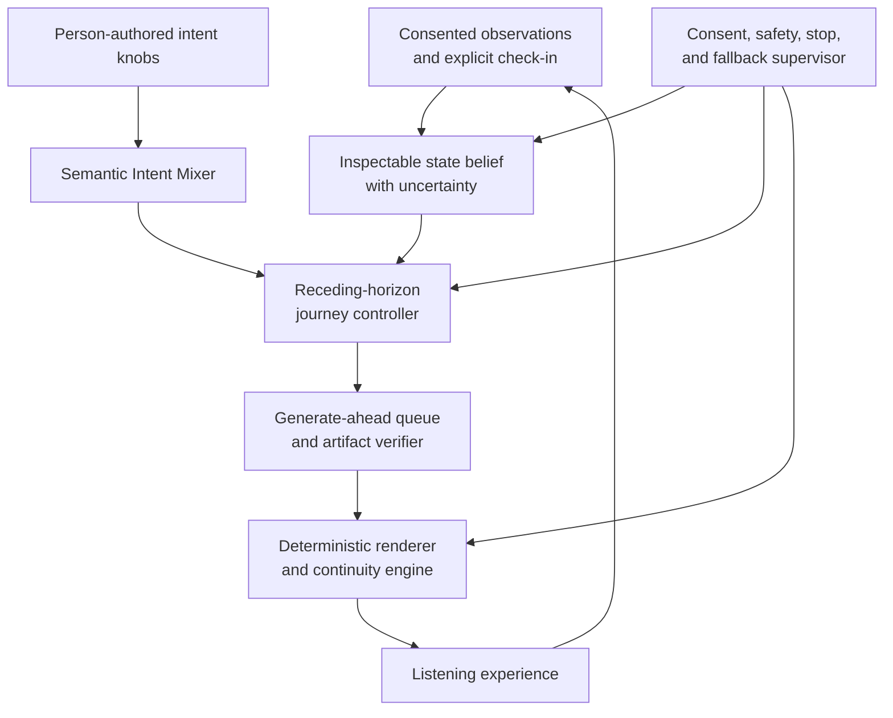

# Adaptive-control and real-time generative-audio architecture

**Research status:** architecture-evidence scout; proposed design, not an
implemented runtime or therapeutic claim.

**Roadmap:** `ANT-Q02`; GitHub issue #33.

**Machine-readable map:**
[`architecture-evidence-map.json`](../sources/architecture-evidence-map.json).

## Research question

How could Antidote remain responsive to a person's changing moment while
preserving agency, uncertainty, generation latency, and a continuous listening
experience?

The answer supported by this scout is a **two-rate, generate-ahead control
architecture**. A slow, inspectable control loop estimates a provisional state,
mixes person-authored intent, and revises a short future journey. A fast,
deterministic audio loop schedules already verified material and smooths
waveform-level transitions. The design is a synthesis and speculative transfer
across several fields; no cited architecture establishes emotional or clinical
benefit for Antidote.

## Evidence classes used here

| Class | Meaning in this dossier |
| --- | --- |
| Scientific precedent | A peer-reviewed method or evaluated system in its original domain |
| Normative standard | A specification or recommendation authoritative for a technical interface or measurement |
| Engineering pattern | Established implementation guidance, not scientific outcome evidence |
| Emerging system | A preprint or early system whose claims require replication and implementation audit |
| Speculative transfer | A useful formalism imported into Antidote without evidence that it works in this domain |
| Qualifying or conflicting evidence | Evidence that narrows a tempting inference or exposes a reliability gap |

## Candidate architecture

This is a candidate system-design model for issues #35 and #39. It does not
change the implemented MVP, authorize sensor collection, select a production
model, or introduce autonomous adaptation.

## Two clocks, two kinds of continuity

| Loop | Typical cadence | Owns | Must not own |
| --- | --- | --- | --- |
| Deliberative control loop | Seconds to minutes; only when a meaningful change or decision point occurs | Consent-scoped observations, user corrections, uncertainty, journey horizon, semantic controls, generation jobs, fallback choice | Sample deadlines, direct diagnosis, hidden personal-model updates |
| Deterministic audio loop | Audio render quanta and scheduled segment boundaries | Buffer reads, gain envelopes, overlap/crossfade, loudness bounds, start/stop, underrun handling | Psychological interpretation, prompt rewriting, consent decisions |

This separation is essential. A large generative model is not a hard-real-time
audio callback. The model may miss a deadline; the audio renderer must not.
When uncertainty or latency rises, Antidote should preserve stable playback,
soften a transition, ask the person, or fall back to approved material.

## State is a belief, not a verdict

Let \(o_t\) contain only consented observations available at time \(t\): explicit
self-report, knob positions, playback actions, optional sensor features, and
their provenance. A provisional belief over moment state is

\[
b_t(x) = p(x_t=x \mid o_{1:t}, u_{1:t-1}).
\]

A generic Bayesian update is

\[
b_t(x) \propto p(o_t \mid x_t=x)
\sum_{x'}p(x_t=x \mid x_{t-1}=x',u_{t-1})b_{t-1}(x').
\]

For Antidote, \(b_t\) is an inspectable model estimate with alternatives and
confidence—not the person's true emotion. Person correction has higher
authority than passive inference. Missing, conflicting, or out-of-distribution
observations widen uncertainty rather than silently becoming a confident
classification.

The physiological literature qualifies the entire layer. Passive-monitoring
reviews report small samples, missing-data and reproducibility problems, and
limited generalizability. A recent electrodermal-activity synthesis finds
stronger evidence for arousal than valence and a mismatch between continuous
affect models and common classification pipelines. These findings support
optional signals as uncertain tailoring variables; they do not support
diagnosis or direct access to a person's inner state.

## Semantic Intent Mixer: the governed “prompt liquid”

User-facing knobs should express human-scale qualities such as **grounding**,
**release**, **brightness**, **intensity**, **familiarity**, or **space**. Each
knob maps to a versioned semantic mixin rather than an undocumented prompt
fragment. If \(k_{j,t}\in[0,1]\) is the requested value for mixin \(m_j\), its
smoothed authority is

\[
\alpha_{j,t} = (1-\rho_j)\alpha_{j,t-1}+\rho_j k_{j,t},
\qquad 0<\rho_j\leq 1,
\]

and the inspectable semantic condition becomes

\[
q_t = q_{\mathrm{base}} \oplus
\bigoplus_{j=1}^{J}\alpha_{j,t}m_j,
\]

where \(\oplus\) means a typed, model-adapter-specific composition—not raw text
concatenation. The mixer records the knob value, mixin version, exclusions,
conflict resolution, resulting semantic plan, and user-visible explanation.
Rate limits, hysteresis, and explicit neutral zones prevent jitter. A model
estimate may propose a knob change, but v0 requires the person to accept it.

Mustango provides peer-reviewed precedent for explicit tempo, key, chord, and
beat conditioning. JASCO provides preprint evidence for global text plus local
time-varying symbolic and audio conditions. Neither proves that convex prompt
mixing is perceptually linear, that a requested condition is realized exactly,
or that the realized music produces a desired felt response.

## Receding horizon and generation deadline

At a decision point, the controller proposes controls for a bounded future
horizon \(H\):

\[
U^*_{t:t+H} =
\operatorname*{arg\,min}_{U}
\sum_{\tau=t}^{t+H}
\left[
L(\hat{x}_{\tau},g_{\tau},u_{\tau})
+\lambda_{\Delta}\lVert u_{\tau}-u_{\tau-1}\rVert_W^2
+\lambda_{R}R(u_{\tau})
\right].
\]

Only the first approved control action is committed; the system then observes,
re-estimates, and replans. This is an MPC-inspired design transfer, not a claim
that a person's affect obeys a known plant model. The \(R\) term represents
risk, uncertainty, and burden; the change penalty discourages abrupt semantic
motion. JITAI concepts supply the health-research vocabulary of decision
points, tailoring variables, intervention options, proximal outcomes, and
decision rules. Early Antidote work remains a rule-guided research instrument,
not an optimized intervention.

The playable buffer must cover the complete generation path:

\[
B_t \geq
L_{\mathrm{observe}}+L_{\mathrm{plan}}+L_{\mathrm{generate}}
+L_{\mathrm{verify}}+L_{\mathrm{schedule}}+M,
\]

where \(M\) is an uncertainty margin. When the inequality cannot be maintained,
the system uses an approved continuation, loop, stem, ambient bed, or graceful
ending. It does not insert unverified bytes or block the audio callback.

## Semantic continuity is not waveform continuity

Antidote must measure and control both layers independently.

### Semantic and musical continuity

Across adjacent generated segments \(a_n,a_{n+1}\), a planning-stage penalty can
compare measured or declared features:

\[
C_{\mathrm{semantic}} =
\lVert f(a_n^{\mathrm{tail}})-f(a_{n+1}^{\mathrm{head}})\rVert_W^2,
\]

where \(f\) may include tempo, beat phase, key/chord compatibility, loudness,
density, timbre embedding, spectral balance, and stage intent. The weights and
compatibility rules must be visible and versioned. Adaptive game-music research
provides precedent for context-responsive composition, while transition
research documents that abrupt cuts, crossfades, resequencing, and
reorchestration are distinct strategies—not interchangeable proof of
seamlessness.

### Waveform continuity

The renderer owns sample-accurate scheduling and gain curves. For a crossfade
window \(s\in[0,1]\), an equal-power candidate is

\[
y(s)=\cos\left(\frac{\pi s}{2}\right)a_n(s)
+\sin\left(\frac{\pi s}{2}\right)a_{n+1}(s).
\]

This engineering operation can reduce a boundary discontinuity; it cannot fix
incompatible harmony, rhythm, timbre, meaning, or emotional pacing. The Web
Audio specification is a normative anchor for scheduled parameter automation
and render-thread processing. EBU R 128 is a normative anchor for loudness
measurement and normalization, not a universal transition recipe.

## Evidence map by subsystem

| Cluster | Anchors | What transfers | What does not transfer |
| --- | --- | --- | --- |
| Moment observation and multimodal fusion | De Angel et al.; D'Amelio et al.; LSL; Jain and Argall | Synchronized observations, uncertainty, missingness, person-specific calibration, Bayesian fusion | Objective emotion, diagnosis, or reliable cross-person inference |
| Decision points and bounded adaptation | Nahum-Shani et al.; García et al.; Kaelbling et al. | Tailoring variables, belief states, constrained horizons, re-estimation | Validated affect dynamics, reward function, or autonomous treatment policy |
| Human authority and correction | Amershi et al.; shared-autonomy literature | Editable proposals, direct manipulation, correction, override, inspectability | Assumption that more feedback automatically improves trust or outcomes |
| Semantic and temporal conditioning | Mustango; JASCO; MusicGen; ACE-Step | Typed musical controls, local/global conditioning, model adapters, adherence checks | Linear prompt semantics, exact realization, felt-response control |
| Streaming and generate-ahead | Wang et al. 2026; model capability records | Emerging chunk-wise generation concepts; explicit latency/buffer budget | Production readiness or locally verified real-time performance |
| Musical and waveform continuity | Hutchings and McCormack; Web Audio; EBU R 128 | Context-responsive music, sample scheduling, gain automation, loudness measurement | Proof that a crossfade is musically or emotionally coherent |
| Local history and reproducibility | Scroll; local-first; event sourcing; W3C PROV; Workflow Run RO-Crate | Local ownership, append-only facts, derived views, lineage, export packaging | Privacy compliance, secure deletion, or truthful interpretation by itself |

The exact source-to-subsystem and bounded-claim records are machine-readable in
the architecture evidence map. Each item is labeled as supporting, qualifying,
mixed, or conflicting.

## Supporting and conflicting evidence

### Supported at the architecture level

- Health-adaptation literature supplies established components for explicit
  decision rules and time-varying tailoring variables.
- MPC and POMDP literature supplies formal tools for short-horizon decisions
  under constraints and partial observation.
- Interactive-ML literature supports involving people throughout the system
  design and correction loop.
- Controllable music models demonstrate that text, melody, tempo, key, chord,
  beat, and time-local controls can be represented computationally.
- Web Audio, EBU loudness guidance, LSL, W3C PROV, and RO-Crate provide
  standards or established interfaces for deterministic rendering,
  measurement, synchronization, and provenance.

### Qualifying or conflicting evidence

- Passive sensing is vulnerable to missingness, short follow-up, inconsistent
  feature construction, small samples, and poor external validation.
- Physiological signals do not uniquely identify a person's felt state;
  arousal may be more tractable than valence, and cross-person generalization
  remains difficult.
- Interactive feedback can reduce perceived trust even when it can correct a
  model, so “more knobs” is not automatically a better experience.
- Current controllable generators evaluate condition adherence imperfectly and
  mostly render offline clips. Real-time interactive generation is still an
  emerging research target.
- Sample-accurate crossfading solves a signal boundary, not musical structure
  or moment-specific emotional fit.
- Provenance records what a system says happened. It does not prove that an
  inference was correct, consent was meaningful, or an outcome was beneficial.

## Bounded manuscript claim contracts

The eventual manuscript may say:

1. Antidote **proposes** a two-rate architecture that separates uncertain,
   inspectable adaptation from deterministic audio rendering.
2. The design **draws on** JITAI, Bayesian belief-state, receding-horizon,
   mixed-initiative, controllable-generation, adaptive-music, and provenance
   precedents.
3. User-authored semantic controls and optional observations **may inform** a
   bounded future journey; their relationship to felt response remains an
   empirical question.
4. Generate-ahead buffering and measured transition constraints **are proposed
   engineering strategies** for avoiding audible discontinuity under model
   latency.
5. The architecture keeps self-report, sensor observations, model estimates,
   semantic intent, realized acoustics, and later response as separate records.

The manuscript must not say:

- sensors reveal what a person truly needs;
- the controller predicts or treats a clinical state;
- a prompt-knob value maps linearly to acoustics or emotion;
- the MVP currently generates or adapts music in real time;
- streaming, interpolation, or crossfading makes audio therapeutically safe;
- citing a standard means Antidote conforms to it.

## Prototype implications, held behind future decisions

1. Preserve the current mock vertical slice and rule-guided authority boundary.
2. Add no sensor until consent, calibration, missingness, sync, and removal
   contracts exist.
3. Evaluate generator latency, continuation quality, temporal control, and
   adherence before setting a buffer horizon.
4. Implement the deterministic playback queue and failure fallback before any
   adaptive generator loop.
5. Treat knob mixins as typed, versioned, reversible domain objects with
   neutral positions and exclusions.
6. Run offline simulations with synthetic observations before any N-of-1 live
   adaptation.
7. Freeze protocol-level proximal outcomes and stop rules before allowing a
   model estimate to alter a listening session.

## Open questions

- Which observations change quickly enough—and reliably enough—to justify a
  decision point?
- What minimum buffer remains tolerable for the chosen local model and hardware
  tiers?
- Which continuity features predict perceived smoothness within a person?
- How many simultaneous knobs remain understandable during an intense session?
- When should uncertainty freeze the plan, ask for confirmation, soften the
  audio, or end the session?
- Can an interpretable rule-guided controller outperform a fixed approved
  journey without increasing burden or surprise?
